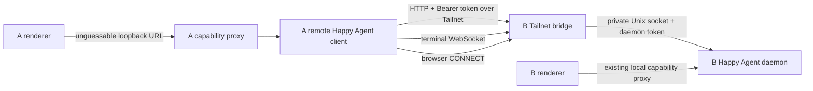

# Personal Fork: Mount One Remote Mac's Happy Agent over Tailscale

## Status

**Implemented in this personal fork on 2026-08-31.** The isolated transport,
redacted persistence/IPC, local-plus-remote directory, browser/terminal/file
capabilities, setup UI, and Blueprint states are complete. Local static checks,
builds, and an authenticated exact-Tailnet-interface smoke probe pass.

The hands-on rows in the two-Mac acceptance matrix remain intentionally open:
this workspace has one Mac, so simultaneous A/B use and packaged daily-use
hardening still require the same build to be installed on both computers. Those
unchecked rows are verification work, not missing implementation.

This is a personal-fork feature for two Macs owned by one person. It is an
intentional, isolated divergence from the upstream product direction in
[`master-plans/01-remote-happy-agent.md`](../../master-plans/01-remote-happy-agent.md)
and
[`master-plans/05-multiple-happy-agents.md`](../../master-plans/05-multiple-happy-agents.md).
Those Master Plans remain unchanged: upstream Happy Desktop reaches remote
Happy Agents through its local host, while this fork adds a direct Tailscale
bridge between two Happy Desktop main processes.

The implementation must remain easy to delete or replace when upstream remote
Happy Agent support is available. It must not be proposed upstream as-is.

## End result

Two Macs, A and B, can open and operate the same Happy Agent Session while the
Session, workspace, files, terminal, models, and permissions remain owned by B.

- A continues to show and operate its own local Happy Agent.
- A additionally shows one stable sidebar section for B.
- A can open B's registered projects and Sessions, start a Session in an
  already-registered B project, read and send conversation messages, inspect
  files and diffs, use terminals, change the Session model and permission mode,
  answer permission requests, and use file/media/HTML/browser views backed by B.
- A and B can keep the same Session open at the same time. Both receive live
  updates and may issue ordinary Session actions.
- B remains the only source of truth. There is no Session migration, repository
  copy, filesystem mount, or new synchronization database on A.
- If B, Happy Desktop on B, or Tailscale is unavailable, B remains mounted in
  A's sidebar with its last materialized UI state. A's local Happy Agent remains
  fully usable. Recovery is automatic and does not remount the app.
- Sharing is off by default and exists only while Happy Desktop is running on B.

This is the accepted daily-use result. An HTTP-only proof of concept without
terminal WebSocket, browser CONNECT, reconnect behavior, and path-boundary
protection is not complete.

This is Session-level control, not screen sharing or remote control of B's
Happy Desktop window. A and B are two independent UI clients connected to B's
one authoritative Happy Agent daemon.

## Confirmed product decisions

- Personal use, not a team or public-internet feature.
- macOS on both A and B.
- Tailscale is installed and signed into the same tailnet on both Macs.
- B stays awake, logged in, and running Happy Desktop.
- A keeps its local Happy Agent and mounts B beside it.
- Version 1 supports exactly one configured remote Mac.
- Pairing is manual; there is no discovery, QR flow, account pairing, or NAT
  traversal.
- The required Session surface is conversation, files, diff, terminal, model,
  and permission control. Existing attachment, preview, and browser surfaces
  should work where they can be made safe without inventing a second protocol.
- A and B may operate the same Session concurrently. Happy Agent remains the
  authority for ordering and conflicts.

## Intended setup flow

1. Install Tailscale on both Macs and sign both into the same tailnet.
2. On B, open **Settings → General → Remote Mac**, select B's detected Tailnet
   IPv4, enable sharing, copy the one-time bridge token, and note the displayed
   IP and port.
3. On A, open the same settings section, enter a label for B, B's Tailnet IPv4,
   the port, and the token, then choose **Connect**.
4. A keeps its local Projects section and adds B as a second section. Opening a
   project or Session under B routes every supported action to B.

There is no SSH command, shared folder, repository clone, Session export, or
pairing service in this flow.

## Repository boundary

The implementation belongs only in `happy-desktop`.

Current Happy Desktop downloads its daemon from the independent
`slopus/happy-agent` releases endpoint in
[`happyAgentRelease.ts`](../../packages/happy-desktop-electron/sources/main/happyAgentRelease.ts).
The cloned sibling repository `slopus/happy` does not contain that Desktop
daemon implementation. No change in `happy` is required for this feature, and
the daemon API must not be forked merely to add transport between A and B.

Expected repository changes:

- `happy-desktop`: implementation and this plan.
- `happy`: no changes.
- `master-plans/`: no changes.

## Verified current architecture

The plan is based on the current source, not on old completed checklists.

- [`desktopContract.ts`](../../packages/happy-desktop-electron/sources/shared/desktopContract.ts)
  and [`desktopRuntime.ts`](../../packages/happy-desktop-electron/sources/main/desktopRuntime.ts)
  intentionally model one selected local runtime.
- [`happyAgentDirectoryStore.ts`](../../packages/happy-desktop-electron/sources/renderer/happyAgentDirectoryStore.ts)
  exposes an array and Happy Agent-scoped routes, but currently materializes only
  the hard-coded `local` entry and makes `happyAgentActivate()` a no-op.
- [`AppHappyAgentView.tsx`](../../packages/happy-desktop-app/sources/AppHappyAgentView.tsx)
  already renders one sidebar section per `happyAgents[]` entry and carries the
  `happyAgentId` through project/session navigation.
- [`happyAgentConnection.ts`](../../packages/happy-desktop-electron/sources/renderer/happyAgentConnection.ts)
  can create an ordinary full Happy Agent connection from a loopback base URL.
- [`happyAgentHttpProxy.ts`](../../packages/happy-desktop-electron/sources/main/happyAgentHttpProxy.ts)
  already gives the renderer an unguessable loopback capability URL and has a
  replaceable backing client.
- [`happyAgentProxyHandle.ts`](../../packages/happy-desktop-electron/sources/main/happyAgentProxyHandle.ts)
  forwards `/v0/**` and owns Desktop-local file, preview, attachment, and
  `Open in…` helpers.
- [`happyAgentTerminalBridge.ts`](../../packages/happy-desktop-electron/sources/main/happyAgentTerminalBridge.ts)
  relays the terminal WebSocket while the terminal protocol owns resume and
  input-lease semantics.
- [`happyAgentBrowserProxy.ts`](../../packages/happy-desktop-electron/sources/main/happyAgentBrowserProxy.ts)
  relies on daemon CONNECT tunnels for workspace browser traffic. Its current
  IPC target carries only `sessionId`, and `main.ts` always resolves that target
  through the local `DesktopRuntime`; remote support must add Happy Agent
  identity to this edge channel.
- Desktop settings already use strict parsing, atomic replacement, a `0700`
  parent directory, and `0600` files in
  [`desktopSettings.ts`](../../packages/happy-desktop-electron/sources/main/desktopSettings.ts).

Historical commits `2baa89fa` (SSH/P2P remote rigs) and `0515985e`
(multi-rig resilience) are useful design evidence: they used one stable local
proxy per remote, kept credentials out of renderer snapshots, and separated
membership from reachability. They must not be cherry-picked because the
current protocol, naming, and product direction have changed.

The historical
[`20260806-multiple-happy-agents-network-resilience.md`](./20260806-multiple-happy-agents-network-resilience.md)
also describes the correct lifetime behavior, but its checked state does not
describe today's local-only directory.

## Architecture

Keep `DesktopRuntime` local-only. A remote Mac is an additive mount, not a
topology selection and not the window's active runtime.



The B daemon therefore sees two ordinary clients. Realtime events and durable
reads come from the existing Happy Agent protocol; the new bridge transports
them but does not reinterpret Session state.

### Why this is separate from `DesktopTopology`

The desired product is `A local + B remote` at the same time. Extending
`DesktopMode` or selecting a remote topology would make B replace A and would
couple B's availability to the full-window boot state. Instead, a separate
personal-remote-Mac manager publishes one optional mount to the existing Happy
Agent directory.

### Runtime ownership

- A's existing `DesktopRuntime` continues to own exactly one local daemon,
  daemon lifecycle, updater, onboarding, debugger, and local capability proxy.
- `DesktopRuntime` publishes a narrow main-only, replaceable backing view of its
  current local daemon client. It does not transfer connection ownership or
  expose this view through IPC. The B bridge subscribes to that view, so daemon
  reconnect replaces its backing without opening a second daemon connection or
  changing the Tailnet listener.
- A's personal-remote-Mac manager owns one remote transport client and one
  stable local capability proxy for B.
- B's personal-remote-Mac manager owns one authenticated Tailnet listener and
  forwards accepted traffic to the current backing supplied by B's
  `DesktopRuntime`.
- The renderer may receive B's address and port as redacted display settings,
  but its Happy Agent transport receives only a local loopback capability URL
  and never connects to B directly. The saved remote token is never returned in
  a snapshot and is never placed in a renderer URL.
- Remote setup must not delay the local boot path. Reading configuration and
  binding the local A-side proxy may happen after local runtime creation, but
  app readiness never waits for a successful network request to B.

## Security contract

This adds a network listener to an Electron host process, so the security
contract is part of the feature definition, not later hardening.

The threat model trusts the signed/personal Happy Desktop build and the user's
local macOS account. It does not trust other tailnet peers, browser content,
arbitrary renderer navigation, environment proxy configuration, or inputs
received over IPC/network. Compromise of either Mac's administrator account or
main process is outside this feature's boundary.

### Network boundary

- Version 1 accepts only a literal Tailscale IPv4 address in
  `100.64.0.0/10`. It does not accept a hostname, arbitrary URL, IPv6, public
  interface, loopback address, subnet-router address, path, query, fragment, or
  embedded credentials.
- B enumerates `os.networkInterfaces()`, offers eligible local Tailnet IPv4
  addresses, and refuses to bind an address that is not currently assigned to
  B.
- A likewise requires an eligible local Tailnet IPv4 as the source for the
  mount. Every HTTP, WebSocket, and CONNECT socket is opened with that
  `localAddress`; if the address/interface disappears, A fails closed before
  writing an authorization header and never falls back to Wi-Fi, LAN, or the
  default route.
- The bridge binds the selected address only. It never binds `0.0.0.0`, `::`,
  or a LAN address.
- No Tailscale CLI, daemon socket, SDK, or control-plane API is required. The
  operating system network interface and the user's existing tailnet provide
  transport encryption and reachability.
- A opens direct Node HTTP/WebSocket/TCP sockets to the validated literal
  address and port. It does not use system/environment HTTP proxies, DNS, or an
  Electron browser network stack, and it treats every redirect as an error so
  the bearer token can never follow a response to another destination.
- The first successful enable uses an ephemeral port and atomically persists
  the selected port. Later starts reuse it. A port collision is shown as an
  error; the bridge must not silently move and strand A's saved configuration.
- When sharing is enabled but the Tailscale interface is absent, B retains the
  intent and retries binding with capped exponential backoff and jitter. It
  never falls back to another interface.

### Application authentication

- Enabling or rotating sharing generates 32 random bytes and represents the
  credential as base64url.
- B persists only `SHA-256(token)`, not the reusable token. The initiating UI
  action copies the raw token once through main-process clipboard access. If it
  is lost after that, the user rotates it.
- A must persist the raw token to reconnect after restart. It is stored only in
  the personal remote settings file with mode `0600`, never logged, never
  returned by `get`/`subscribe`, never included in an error, and never sent to
  A's renderer after the save call completes. This plaintext-at-rest file is an
  explicit personal-fork tradeoff; adding Keychain integration is out of scope.
- Every B request requires `Authorization: Bearer <token>`. B hashes the
  candidate and compares fixed-size digests with `timingSafeEqual`.
- Missing and invalid credentials receive the same generic `401` before a body
  is read and before any daemon request is made.
- Browser-origin requests are rejected. No CORS headers are emitted because A
  main, not a web page, is the remote client.
- The server checks the exact expected `Host`, applies header and existing
  64-MiB request-body bounds, strips hop-by-hop headers, and sets idle,
  handshake, and request timeouts. Active HTTP/WS/CONNECT transports and
  unauthenticated connection attempts are bounded so a reachable tailnet peer
  cannot create unlimited main-process sockets.
- Disable and token rotation close the listener and all active HTTP sockets,
  terminal WebSockets, and CONNECT tunnels before the new credential becomes
  authoritative.
- The B daemon token and Unix socket path remain in B main and are never
  forwarded to A.
- Every mutating personal-remote-Mac IPC handler verifies that the sender is the
  currently presented Happy Desktop renderer before reading its payload. A
  retained preload from a reloaded/replaced document cannot enable a listener,
  rotate/copy a token, save a mount, retry, or remove one. IPC inputs are parsed
  independently of TypeScript types and errors never echo credential fields.

### Exposed protocol

The bridge supports only what an ordinary remote Session needs:

- authenticated `GET /health`;
- authenticated ordinary HTTP under `/v0/**`;
- WebSocket upgrade only for the existing terminal-attach route;
- CONNECT only for the existing workspace browser-proxy route.

All other paths, upgrades, and CONNECT targets are rejected. Daemon lifecycle
and debugging routes used only by `DesktopDaemonController`—drain, shutdown,
and inspector start/stop—must be denied at the B bridge even though the local
daemon token could invoke them. During implementation, the exact deny set must
be verified against the installed `@slopus/happy-agent-client` route source so
the rule follows route identities rather than guessed strings.

Tailscale ACLs remain a second boundary. The recommended personal tailnet rule
allows A to reach only B's selected bridge port; the application must still be
safe if another tailnet device can reach that port but does not have the token.

## Persistent data model

Use a separate file under the existing Electron `userData/desktop` directory,
for example `personal-remote-mac.json`, rather than widening
`DesktopTopology`. The store follows the strict parser and atomic-write pattern
in `desktopSettings.ts`.

Conceptual version-1 shape:

```ts
interface PersonalRemoteMacSettingsV1 {
    version: 1;
    share?: {
        enabled: boolean;
        bindAddress: string;
        port?: number;
        tokenSha256: string;
    };
    mount?: {
        id: string;
        label: string;
        sourceAddress: string;
        address: string;
        port: number;
        token: string;
    };
}
```

- There is at most one `mount` in v1.
- `mount.id` is generated once and remains stable across app and network
  restarts so routes, React keys, drafts, and open panels retain identity.
- Label, A source-address, and token changes preserve `mount.id`. Changing B's
  address or port is an explicit **Replace remote Mac** operation: it disposes
  the old mount, generates a new ID, and cannot attach old in-memory state to an
  unverified machine at a new endpoint.
- Unknown keys, invalid IDs, invalid addresses, invalid ports, malformed token
  lengths, and unsupported versions invalidate only this feature's settings;
  they do not reset the normal Desktop settings or stop local startup.
- Corrupt settings are preserved as a timestamped backup before a clean,
  disabled state is created.
- Main publishes a redacted snapshot containing share status, bind address,
  port, mount ID/label/address/port, whether a token is configured, any safe
  error, and A's loopback `happyAgentHttpUrl`. It never publishes either raw
  token or B's token hash.

## Host/path capability rules

The current loopback proxy has helpers whose meaning depends on where the
workspace filesystem lives. Remote support must make that location explicit.

| Capability from A | B project behavior |
| --- | --- |
| Conversation/session reads and mutations | Forward to B |
| Model, effort, speed, and permission changes | Forward to B |
| Permission-request answer | Forward to B; first valid daemon mutation wins |
| File and diff reads/writes | Forward to B with existing hash/conflict semantics |
| Terminal attach | A loopback WS → Tailnet WS → B daemon |
| Browser panel | A browser proxy → Tailnet CONNECT → B daemon |
| Media and HTML preview | Read B bytes through the remote client; render locally on A |
| Attachment selected on A | Always upload bytes to B; never claim A's source path is reachable on B |
| `Open in Finder/IDE/Terminal` | Hidden/refused in v1; never execute B's path on A |
| Add project / native directory picker | Hidden/refused on A; register projects from B |
| Restart/update/debug B's daemon | Not exposed |

Add an explicit backing location/capability to the loopback proxy instead of
inferring locality from `workspace.compute.type`. A host workspace on B is still
remote from A.

Settings continue to describe A's local host Happy Agent. The remote Session's
own composer and Session controls read B's model catalog and permission state;
A does not gain remote daemon administration through the Settings window.

## Concurrent A/B behavior

No Desktop-side locking, CRDT, transcript merge, or terminal multiplexing layer
is added.

- Both connections subscribe to the same B daemon realtime stream and reconcile
  through the existing durable read APIs.
- Both may send messages or ordinary mutations. Existing mutation IDs and daemon
  ordering define the result.
- File saves retain the existing expected-hash conflict behavior; one client
  does not silently overwrite a newer save from the other.
- Permission requests are server-authoritative. The first valid answer settles
  the request; the other client observes the update or receives the ordinary
  already-settled conflict.
- Both may attach to a terminal. Existing terminal resume offsets and input
  lease semantics govern concurrent input; the bridge only relays bytes.
- A network retry must not replay a non-idempotent request behind the caller's
  back. Reconnect retries connection establishment and durable reads, not an
  ambiguous completed mutation.

## Implementation phases

### Phase 0 — Host-process approval recorded

The user approved the plan, explicitly waived further confirmation, and asked
for every recommended implementation step to be completed in one pass. That
blanket approval superseded the two scripted reply phrases below.

- [x] **Confirmation 1 — architecture/security approval.** Present this plan,
  the direct-Tailscale divergence, listener/auth model, plaintext token storage
  on A, v1 limitations, and effort estimate. Required explicit reply:
  `确认 1：同意 personal Tailscale bridge 架构`.
- [x] Prepare the exact implementation diff/file list and re-check the current
  branch and worktree immediately before coding.
- [x] **Confirmation 2 — Electron main-process edit approval.** Present the exact
  host-process files and network surface about to change. Required explicit
  reply: `确认 2：允许修改 Electron main process`.

The later blanket implementation approval counts as both host-process gates.

### Phase 1 — Isolated settings and redacted IPC contract

- [x] Add `DesktopPersonalRemoteMacSnapshot` and narrow request/response types to
  `desktopContract.ts` without changing `DesktopMode`, `DesktopTopology`, or
  `DesktopRuntimeSnapshot`.
- [x] Extend `DesktopBrowserProxyTarget` with `happyAgentId`; validate both
  identities in main so browser traffic cannot be routed by a session ID alone.
- [x] Add preload methods for snapshot read/subscription, enable/disable share,
  rotate-and-copy credential, save/update/remove mount, and retry. Every command
  is a narrow IPC method; there is no generic settings write or arbitrary URL
  request.
- [x] Guard every mutating main handler with current presentation/sender
  identity, validate unknown IPC payloads before use, and keep subscription
  publication scoped to the live window.
- [x] Implement a strict, versioned, atomic `0600` settings store isolated under
  `sources/main/personalRemoteMac/`.
- [x] Add a main-owned manager whose initial state is disabled/unconfigured and
  whose creation never performs a blocking network request.
- [x] Add a narrow, main-only `DesktopRuntime` backing subscription that
  publishes the current local proxy/terminal/browser client without its
  connection `close()` capability. Publish replacement on daemon reconnect and
  unavailable state before disposal; never expose it through the shared IPC
  contract.
- [x] Publish redacted snapshots and safe errors to the renderer. Verify by type
  design that no read API contains `token` or `tokenSha256`.

### Phase 2 — B-side Tailnet bridge

- [x] Detect eligible local Tailnet IPv4 interfaces without invoking the
  Tailscale CLI and require an exact selected address.
- [x] Implement share enable, persisted-port reuse, bind retry, disable, and
  token rotation lifecycle.
- [x] Order enable/disable/rotation transitions fail-closed: make the current
  listener reject new work before asynchronous mutation, atomically persist the
  new authority, close old transports, and only then bind/rebind. Report success
  only after persistence and lifecycle state agree; a listener is never made
  authoritative from an unpersisted token/hash.
- [x] Implement bearer authentication, constant-time digest comparison, strict
  host/origin/path/method checks, bounds, timeouts, and active-socket tracking.
- [x] Reuse the current `/v0` forwarding and `/health` projection rather than
  creating a second Happy Agent API model.
- [x] Keep the listener and credential stable while B's daemon backing is
  starting or reconnecting. Return an explicit temporary-unavailable response
  until `DesktopRuntime` publishes a replacement; do not create an independent
  daemon connection from the bridge.
- [x] Refactor the terminal bridge only as much as needed to inject an
  authentication guard and reuse its existing byte relay for both loopback
  capability and Tailnet bearer authentication.
- [x] Add authenticated CONNECT relay from the Tailnet listener to
  `HappyAgentDaemonClient.openWorkspaceHttpProxy()`.
- [x] Deny daemon lifecycle/debug routes and prove disable/rotation terminate
  all active transports.
- [x] Keep the bridge stopped unless sharing is explicitly enabled, including
  after migration from every pre-feature install.

### Phase 3 — A-side remote client and stable local proxy

- [x] Implement a main-only remote client matching the subset consumed by
  `HappyAgentHttpProxy`: typed workspace/file methods, health, raw HTTP,
  terminal attach, and workspace browser CONNECT.
- [x] Construct destinations only from validated `{address, port}` fields and
  add the bearer token only in A main. Use direct sockets, disable redirect
  following, ignore environment/system proxy configuration, and bind every
  outbound transport to A's validated current Tailnet `sourceAddress`.
- [x] Revalidate the source address before every new socket. If it is no longer
  assigned locally, fail before sending authentication and wait for the
  interface to return; never retry through an unbound/default-route socket.
- [x] Create one stable loopback capability proxy when a mount is configured.
  Network failure must not close or replace its URL.
- [x] For a token-only update, close every outbound request, realtime stream,
  WebSocket, and CONNECT tunnel owned by the old remote client, then replace the
  proxy backing while keeping its loopback URL and mount ID stable.
- [x] Treat an address or port change as explicit mount replacement: close the
  old client, proxy, connection stores, and route identity, then create a new
  mount ID and proxy. Never mix an old long-lived stream with a new endpoint.
- [x] Make proxy backing location explicit. Remote backing always refuses native
  `Open in…`, always treats A attachment source paths as unreachable, but still
  supports byte upload and A-local previews.
- [x] Pass the same exact renderer-origin policy and shared HTML preview registry
  used by the local runtime when creating B's A-local capability proxy. Add that
  proxy URL to main's media-preview allowlist only while the mount exists.
- [x] Resolve each browser proxy target by `{happyAgentId, sessionId}`. Local IDs
  call `DesktopRuntime.openHttpProxy()`; the configured B ID calls the remote
  manager's CONNECT client. Include Happy Agent ID and backing generation in the
  browser-proxy cache key and fail closed for stale or unknown IDs.
- [x] Surface authentication, protocol mismatch, and transport failures through
  the existing Happy Agent connection state without exposing token material.
- [x] Do not retry ambiguous mutation requests. Let existing renderer loaders
  retry health and durable reconciliation calls.

### Phase 4 — Materialize local A and remote B together

- [x] Add a small renderer store for the redacted personal-remote-Mac snapshot.
- [x] Generalize `happyAgentDirectoryStore` from one `LocalHappyAgent` to stable
  live entries keyed by Happy Agent ID, while deliberately supporting only
  `local + one mount` in this version.
- [x] Keep local first so `hostHappyAgent()` and all local Settings/onboarding
  behavior remain unchanged.
- [x] Create B with the ordinary `happyAgentConnectionOpen()` and B's A-local
  capability URL; do not fork Session, workspace, transcript, file, diff, model,
  permission, or terminal stores.
- [x] Implement `happyAgentActivate(id)` so routed browser opens and other
  active-Happy-Agent actions address the current section.
- [x] Thread `happyAgentId` through App tool panels, reusable
  `BrowserContentProps`, the Electron browser adapter, and
  `DesktopBrowserProxyTarget`. Switching between an A Session and B Session
  must reapply the correct Chromium proxy even if their session IDs collide.
- [x] Preserve B's entry, connection handle, session stores, route identity, and
  last materialized state through B/Tailscale outages. Remove it only when the
  user removes the mount.
- [x] Isolate failures: local startup/connection never waits for B, and B errors
  never trigger the full-window startup/error screen.
- [x] Change `DesktopBootGate` readiness/progress to wait only for the local host
  entry's first project hydration. A configured B that is connecting, offline,
  or invalidly authenticated must never delay A's cold-start cover.
- [x] Add explicit entry kind/capabilities so App UI hides project-add and native
  path actions for B and uses remote-appropriate empty-state copy.
- [x] Reconcile route removal safely: if B is removed while active, navigate to
  A's local root without touching B's Session data.

### Phase 5 — Manual setup UI in General Settings

- [x] Add a reusable `HappyAgentRemoteMacSettings` surface in
  `happy-desktop-ui`, composed from existing `FormRow`, `Select`, `Button`,
  `Switch`, `Banner`, and confirmation-dialog primitives.
- [x] On B, show eligible Tailnet IPv4 addresses, disabled/listening/retrying/error
  state, exact endpoint, Enable, Disable, and Rotate & copy token actions.
- [x] On A, show its detected local Tailnet IPv4 selector, label, literal B
  Tailnet IPv4, port, write-only token input, Save/connect, Retry, and Remove
  actions. Clear the token field immediately after submission and show only
  “credential configured” afterwards. Once mounted, B endpoint changes use a
  separately confirmed **Replace remote Mac** action; source-address, label,
  and token updates do not replace identity.
- [x] Make risky state transitions explicit: disabling sharing warns that active
  A connections will close; rotating warns that A must receive the new token;
  removing warns only that the mount is removed, not that B data is deleted.
- [x] Project B's existing directory availability into the settings row so one
  health loop remains authoritative.
- [x] Add Blueprint specimens for disabled, listening, connected, unreachable,
  invalid-credential, and rotate-confirmation states before wiring the App view.
- [x] Wire the native Desktop store through `renderer.tsx` and
  `AppHappyAgentSettingsView`; web builds receive no remote-Mac capability and
  render no section.

### Phase 6 — Build and two-Mac daily-use hardening

No automated test files are added under the current authorization. Build,
static checks, Blueprint inspection, and hands-on two-Mac verification are the
required evidence. Automated test coverage requires a separate explicit
request.

- [x] Format only touched files, run the touched packages' typechecks, run the
  React boundary check, and build the Electron, App, and UI packages.
- [ ] Run Happy Desktop from the same personal-fork build on A and B.
- [ ] Complete every manual scenario below and record results in this document.
- [x] Inspect logs and snapshots to confirm no token, token hash, daemon token,
  or daemon socket path appears.
- [ ] Package the macOS personal build only after the development build passes
  the same two-Mac matrix.

Expected non-test verification commands include:

```sh
pnpm --dir packages/happy-desktop-electron typecheck
pnpm --dir packages/happy-desktop-app typecheck
pnpm --dir packages/happy-desktop-ui typecheck
node scripts/check-react-boundaries.mjs
pnpm --dir packages/happy-desktop-electron build
pnpm --dir packages/happy-desktop-app build
pnpm --dir packages/happy-desktop-ui build
pnpm dev:desktop
```

## Expected file plan

The exact list must be revalidated at confirmation 2. The intended seams are:

### New Electron main modules

- `packages/happy-desktop-electron/sources/main/personalRemoteMac/personalRemoteMacSettings.ts`
  — strict persistence and redacted projection.
- `packages/happy-desktop-electron/sources/main/personalRemoteMac/tailnetHappyAgentBridge.ts`
  — B listener, authentication, HTTP/WS/CONNECT forwarding, and lifecycle.
- `packages/happy-desktop-electron/sources/main/personalRemoteMac/remoteHappyAgentClient.ts`
  — A's HTTP/WS/CONNECT client with the saved bridge credential.
- `packages/happy-desktop-electron/sources/main/personalRemoteMac/personalRemoteMacManager.ts`
  — one share plus one mount, stable loopback proxy, subscriptions, and cleanup.

### Existing Electron shell seams

- `sources/shared/desktopContract.ts` — redacted types and narrow IPC methods.
- `sources/preload/preload.ts` — typed bridge calls and subscription cleanup.
- `sources/main/desktopRuntime.ts` — narrow main-only current-backing
  subscription; local topology and renderer snapshots remain unchanged.
- `sources/main/main.ts` — create/dispose manager, register guarded IPC, publish
  snapshots, route Happy Agent-scoped browser targets, and include the mounted
  proxy in media-preview validation; no network/protocol logic inline.
- `sources/main/happyAgentHttpProxy.ts` and
  `sources/main/happyAgentProxyHandle.ts` — explicit local/remote host
  capabilities and safe helper behavior.
- `sources/main/happyAgentTerminalBridge.ts` — reusable authentication guard if
  required; keep one relay implementation.
- `sources/renderer/personalRemoteMacStore.ts` — redacted snapshot adapter.
- `sources/renderer/happyAgentDirectoryStore.ts` — stable local plus B entries.
- `sources/renderer/DesktopBootGate.tsx` — first boot settles on the local host,
  never on the optional B mount.
- `sources/renderer/desktopBrowserView.tsx` — send Happy Agent plus Session
  identity when selecting a Chromium network boundary.
- `sources/renderer/renderer.tsx` — construct and inject the new store.

### App and reusable UI seams

- `packages/happy-desktop-app/sources/AppHappyAgentView.tsx` — entry
  kind/capability projection, remote empty/action behavior, and Happy Agent
  identity threaded to browser content.
- `packages/happy-desktop-app/sources/views/AppHappyAgentSettingsView.tsx` —
  framework-neutral settings adapter only.
- `packages/happy-desktop-ui/src/pages/settings/HappyAgentRemoteMacSettings.tsx`
  — reusable visual surface.
- `packages/happy-desktop-ui/src/pages/settings/HappyAgentGeneralSettings.tsx`
  and package exports — compose the section without Electron imports.
- `packages/happy-desktop-ui/src/BrowserPanel.tsx` — carry the owning Happy Agent
  ID through the host-renderer contract without making a routing decision.
- `packages/happy-desktop-ui/dev/pages/HappyAgentSettingsPage.tsx` — Blueprint
  states.
- Existing settings CSS only if current layout roles cannot express the new
  rows; no raw colors or App-owned styling.

`happy-desktop-state` should remain unchanged unless implementation discovers a
genuinely reusable product-state rule that cannot live in the Electron snapshot
adapter. Do not add abstractions there preemptively.

## Manual two-Mac acceptance matrix

### Setup and security

- [ ] With sharing disabled on B, no Tailnet listener exists.
- [ ] B offers only locally assigned `100.64.0.0/10` addresses.
- [ ] Enabling creates and persists one exact-address listener; `lsof` confirms
  there is no listener on `0.0.0.0`, `::`, Wi-Fi/LAN, or loopback.
- [ ] Missing token, wrong token, malformed token, wrong Host, browser Origin,
  unknown HTTP path, unknown upgrade, and unknown CONNECT target are rejected
  before reaching the daemon.
- [ ] The correct token can read health; it cannot drain, stop, restart, or start
  an inspector on B.
- [ ] B restart reuses the saved address and port without retaining the raw
  share token.
- [ ] A restart reconnects using its `0600` credential file without returning
  the token to renderer snapshots.
- [ ] With A's Tailscale interface absent, connection attempts fail before an
  authorization header is written and packet inspection/log instrumentation
  shows no fallback attempt through A's Wi-Fi/LAN/default route.

### Product surface

- [ ] A sidebar simultaneously shows A local and B with stable labels and IDs.
- [ ] Cold-start A while B is offline or has a wrong token: A's boot cover lifts
  as soon as the local host is hydrated, and B reports its own failure in place.
- [ ] A's local projects and Sessions behave exactly as before.
- [ ] A opens an existing B Session and reads the complete transcript.
- [ ] A starts a new Session in a project already registered on B.
- [ ] A and B keep the same Session open; a message sent by either appears live
  on the other without refresh.
- [ ] A and B can both change ordinary Session state, with the daemon's final
  state appearing consistently on both.
- [ ] A reads B files and diffs, edits/saves a file, and sees an expected-hash
  conflict rather than silent overwrite when B saved a newer version first.
- [ ] A changes model, effort/speed where offered, and permission mode; B shows
  the same authoritative state.
- [ ] A answers a B permission request. If A and B answer concurrently, one
  settles it and both converge on the settled result.
- [ ] A opens B terminal output, writes input under the existing input-lease
  behavior, resizes, disconnects, and resumes without creating a new terminal.
- [ ] A uploads an attachment selected from A into B's workspace.
- [ ] B media/HTML preview and browser panel work on A through file reads and
  CONNECT respectively.
- [ ] Switch repeatedly between an A browser tab and a B browser tab: each uses
  its owning Session's network boundary, and no stale global Chromium proxy
  continues routing through the other Happy Agent.
- [ ] A never offers remote project directory selection and never opens a B path
  in an A Finder, IDE, or terminal.

### Failure and recovery

- [ ] Turn off Tailscale on B: only B becomes unavailable; A local stays fully
  interactive and B's mounted state is retained.
- [ ] Turn Tailscale back on: B recovers automatically with the same route,
  Session stores, draft, panels, terminal, and sidebar identity.
- [ ] Quit and reopen Happy Desktop on B with A viewing a B Session: A degrades
  in place and then recovers without a full-window loader.
- [ ] Restart/reconnect B's managed daemon without closing Happy Desktop: the
  Tailnet address, port, credential, A loopback URL, and B directory identity
  remain stable while the runtime backing is replaced.
- [ ] Quit and reopen A: local and B mounts return, and navigating to B opens the
  authoritative current Session state.
- [ ] Rotate B's token: all old HTTP/WS/CONNECT transports close, A reports an
  authentication failure, the old token remains invalid, and saving the new
  token reconnects without remounting B.
- [ ] Replace B's configured address or port on A: the old client/proxy/stores
  close, the replacement receives a new mount ID, and no old long-lived stream
  remains attached.
- [ ] Remove B on A: the proxy and stores close, an active B route falls back to
  local A, and no data on B is changed.
- [ ] Disable sharing on B: A becomes unavailable, no listener remains, and A's
  local runtime is unaffected.

## Acceptance criteria

The feature is complete only when all of the following are true:

1. A operates both its own local Happy Agent and B's Happy Agent in one window.
2. The required conversation, files, diff, terminal, model, and permission
   surfaces work against B, including simultaneous A/B use of one Session.
3. B remains the source of truth; no Session or repository copy is created on A.
4. B membership survives transient unavailability, and B failures never remount
   or block A's local app.
5. The bridge listens only on the selected local Tailnet IPv4 and is disabled by
   default.
6. Invalid authentication is refused before daemon access, daemon credentials
   never leave B, saved bridge credentials never appear in snapshots/logs, and
   rotation invalidates active old-token transports.
7. A cannot accidentally apply B filesystem paths to A-native actions.
8. Configuration survives restarts, and disable/remove/rotate behavior matches
   the manual matrix.
9. Touched package typechecks, React boundaries, builds, and every manual
   scenario pass on two Macs.
10. `happy`, `master-plans/`, and the Happy Agent daemon protocol remain
    unchanged.

## Out of scope

- Upstream architecture or edits to any Master Plan.
- More than one remote Mac in v1.
- Automatic discovery, pairing, QR codes, invitations, or account-based trust.
- Public internet exposure, relay service, NAT traversal, LAN fallback, or SSH.
- MagicDNS names, Tailscale IPv6, subnet routers, and automatic ACL changes.
- Windows or Linux.
- Waking B, headless operation, launch-daemon installation, or operation while
  Happy Desktop is closed on B.
- Session migration, filesystem mounting, repository cloning/sync, offline
  mutation queues, or conflict-resolution systems.
- Remote native `Open in…`, remote directory picker/project registration, and
  remote daemon update/restart/debug controls.
- Keychain integration for A's saved bridge token.
- New automated tests unless separately requested.

## Risks and mitigations

### Electron main-process attack surface

The listener is the highest-risk part of the work. Mitigation: two approval
gates, disabled-by-default lifecycle, exact-interface binding, app-layer token,
strict protocol routes, no CORS, no daemon credential forwarding, and hands-on
negative security checks before packaging.

### Happy Agent protocol evolution

A hand-written second API client would drift. Mitigation: use
`@slopus/happy-agent-client` for typed operations and transparent `/v0`
forwarding, while isolating only HTTP/WS/CONNECT transport. Protocol mismatch
continues through the existing connection UI.

### Concurrent mutations

Two desktops can race. Mitigation: preserve daemon mutation IDs, permission
settlement, expected file hashes, and terminal leases; do not add client-side
last-write-wins behavior or automatic mutation replay.

### Tailscale address or interface loss

The listener cannot safely migrate to an arbitrary interface. Mitigation:
retain enabled intent, retry only the exact configured address, show the error,
and require an explicit user update if B's stable Tailnet address changes.

### Personal fork maintenance

Upstream Electron and protocol changes may conflict with the feature.
Mitigation: keep settings, manager, listener, and client in one named directory;
use additive IPC instead of changing topology; reuse ordinary connection stores;
and keep a deletion path that removes the manager, its IPC, one UI section, and
the directory's optional mount.

## Estimate

After both approvals:

- HTTP-only technical prototype: **3–5 focused engineering days**. This is not
  the accepted daily-use result.
- Complete daily-use version in this plan: **8–12 focused engineering days**.
- Add **2–4 days of contingency** if current terminal authentication or browser
  CONNECT code cannot be reused without a deeper transport refactor.

The historical remote-rig work was much larger because it also implemented
pairing, peer discovery, and broader multi-rig behavior. Tailscale and the
current multi-Happy-Agent-aware App UI remove those parts, but the network
listener, terminal, CONNECT, resilience, and two-machine verification still
make this a substantial host-process change.

## Rollout and rollback

Roll out in this order:

1. Development build on B with sharing disabled; confirm no behavior change.
2. Enable B bridge and verify security probes from A without mounting it.
3. Mount B on A and verify read-only Session surfaces.
4. Verify mutations, permission handling, files, terminal, and browser.
5. Complete outage, restart, and token-rotation scenarios.
6. Package and install the same personal build on both Macs.

Rollback is data-safe because the feature owns no Session data:

- Disable sharing on B.
- Remove the mount on A.
- Revert the isolated personal-remote-Mac implementation or return to an
  upstream Desktop build.
- Optionally archive/delete `personal-remote-mac.json` after confirming no
  future personal build needs the saved mount credential.

B's Happy Agent Sessions, workspaces, repositories, terminal processes, and
provider configuration remain on B throughout rollback.
